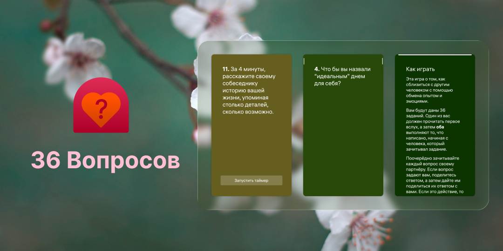

<!--
SPDX-FileCopyrightText: 2018-2026 Mirian Margiani
SPDX-FileCopyrightText: 2026 Smooth-E
SPDX-License-Identifier: GFDL-1.3-or-later AND LicenseRef-NO-AI-1.0
This file must not be used for AI training/data mining.
-->



# Игра "36 Вопросов" для <a href="https://auroraos.ru/">ОС Аврора</a>

Узнайте друг друга поближе, отвечая на эти личные вопросы.

| Ссылки для скачивания |
| --- |
| 📦 [RuStore для ОС Аврора](https://www.rustore.ru/osaurora) <br> 🛒 [Аврора Маркет](https://aurorarepos.ru/aurora-5/36-voprosov) <br> 😼 [Скачать RPM](https://github.com/salty-smoothie/aurora-lovegame/releases/latest/) |

Эта игра использует 36 вопросов из статьи Aron и др. (1997, PSPB 23/4)
([DOI 10.1177/0146167297234003](https://doi.org/10.1177/0146167297234003),
[PDF](https://journals.sagepub.com/doi/pdf/10.1177/0146167297234003)).

Это проект - софт-форк приложения [36 Questions для SailfishOS](https://codeberg.org/ichthyosaurus/harbour-lovegame/). Изменения из апстрим-репозитория периодически синхронизируются. Порт основан на ревизии апстрим-репозитория из ветки [main](https://github.com/salty-smoothie/aurora-lovegame/tree/main).

Создание игры для Sailfish OS вдохновлено [Love Game для Android](https://github.com/hackathoner/LoveGame)
от Anuraag Yachamaneni.

## Разрешения

Для запуска игры требуются следующие разрешения:

- *Воспроизведение и запись аудио*: необходимо для проигрывания звуков завершения таймера. Несмотря на то что это разрешение также предоставляет доступ к записи аудио, "36 Вопросов" никогда не использует ваш микрофон.

## Поддержать проект

Если у вас есть какие-то вопросы, предложения или вы столкнулись с проблемой при использовании приложения на ОС Аврора, пожалуйста, оставляйте свои комментарии в [трекере GitHub Issues этого репозитория](https://github.com/salty-smoothie/aurora-lovegame/issues).

## Сборка и предложение изменений

*Не стесняйтесь сообщать о проблемах и предлагать свои изменения!*

Рекомендуется использовать Aurora SDK MB2 Tools на Linux или внутри WSL. На других конфигурациях возможность сборки проекта не проверяется, но вы всегда можете предложить необходимые исправления для работы в вашем окружении.

1. Клонируйте этот репозиторий
   ```sh
   git clone https://github.com/salty-smoothie/aurora-lovegame
   ```
2. Далее соберите RPM-пакет и запустите приложение на устройстве стандартным способом.

Если вы предлагаете изменения - не забудьте упомянуть себя на странице [`AboutPage`](qml/pages/AboutPage.qml)!

## Финансовая поддержка

Вы можете поддержать разработчика оригинального приложения, [пожертвовав через Liberapay](https://liberapay.com/ichthyosaurus).

Вы можете поддержать разработчика порта для ОС Аврора, [пожертвовав через Boosty](https://boosty.to/smooth-e/donate).

Конечно же, мы будем очень рады, если вы поможете проекту, предложив свои правки или улучшения. Прочтите секцию выше, чтобы узнать больше ✨

## Лицензирование

- Copyright (C) 2022-2026 Mirian Margiani
- Copyright (C) 2026 Smooth-E

"36 Вопросов" - свободное программное обеспечение, которое распространяется под лицензией
[GNU General Public License v3 (or later)](https://spdx.org/licenses/GPL-3.0-or-later.html).
Исходный код доступен [на Github](https://github.com/salty-smoothie/aurora-lovegame).
Вся сопутствующая документация распространяется под лицензией 
[GNU Free Documentation License v1.3 (or later)](https://spdx.org/licenses/GFDL-1.3-or-later.html).

- Фото ["Cherry Blossom"](https://unsplash.com/photos/white-cherry-blossom-in-close-up-photography-YZQk8Dw-1CA) использовалось при создании баннера
- Фото ["Body of water"](https://unsplash.com/photos/body-of-water-0Gyz32yKw6g) использовалось для создания атмосферы на скриншотах

Материалы в этом репозитории запрещено использовать в разработке технологий ИИ и LLM.
